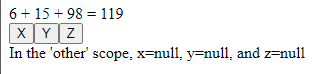

# React Salty State

A simple global state system for React. Built on top of [react-sweet state](https://github.com/atlassian/react-sweet-state). This exists because I got annoyed passing callbacks to child components and wanted to minimize writing boilerplate.

There are three hooks. Each takes a string argument that sets the scope. Each scope represents a global data store.

The main hook is ```useSalty```

```
const [{value, other_value}, set] = useSalty('this_scope')
```
This returns an array.The first element is the data for this scope. If an item has not been set yet, it will be null.

The second element is the ```set``` function. It takes an object comprised of key-value pairs as its only argument:

```
set({value: 56, other_value: "Hello", yet_another_value: [4,6,4.5]})
```
```set``` merges the current data with the object passed as an argument. 

The other two hooks are for convenience:

```
const {value, other_value} = useSaltyRead('this_scope')
```
This returns items in the data store without the ```set``` function.

```
const set = useSaltyWrite('this_scope')
```
This returns only the set function.

## Example Usage
```
/**
 * Component to show the sum of some numbers
*/
function A(){
  // Get values and the setter for the 'test' scope
  const[{x, y, z}, set] = useSalty('test');

    // Set some initial values on mount
  React.useEffect(() => {
    set({
      x: 6,
      y: 15,
      z: 98
    });
  }, []);

  // Render the sum
  return (
    <div>{x} + {y} + {z} = {x+y+z}</div>
  );
}


/**
 * Component with buttons to increment values
 */
function B(){
  // Get the values and the setter for the 'test' scope using helper hooks
  const {x, y, z} = useSaltyRead('test');
  const set = useSaltyWrite('test');

  // Render some buttons that increment x, y, and z by 1, 2, and 3
  return (
    <>
      <button onClick={() =>set({x: x+1})}>X</button>
      <button onClick={() =>set({y: y+2})}>Y</button>
      <button onClick={() =>set({z: z+3})}>Z</button>
    </>
  )
  
}

/**
 * Render A and B
 */
const App = () => {
  // Get values for a scope named 'other'
  const {x, y, z} = useSaltyRead('other');

  // Render A and B, 
  return (
    <>
      <A/>
      <B/>
      <div>In the 'other' scope, x={x || "null"}, y={y || "null"}, and z={z || "null"}</div>
    </>
  );
};
```

This displays as:




